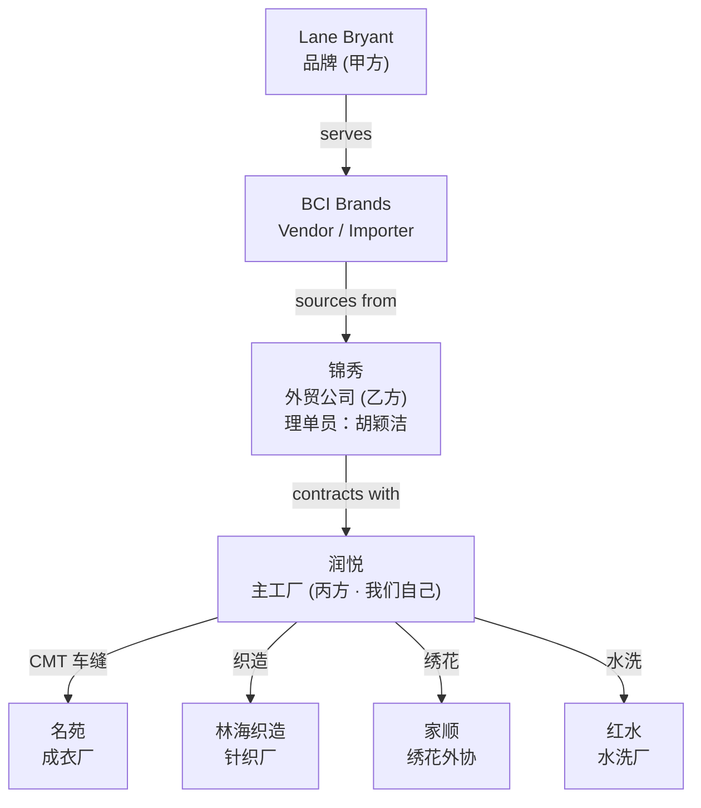

# How This Garment Factory Works
## Business Model, Order Flow, Documents, and Production Workflow

> **本文用途**：写给一个懂业务和软件、但对服装制造流程不熟的产品人 / 创始人，帮助你在设计 AI 系统之前，理解这家工厂（宁波润悦服饰有限公司）的真实运作方式。
>
> **依据**：仅使用当前 dataset 已经收集到的证据 —— 2026 订单汇总表、报价表、FBB54S2-997XLB 完整款档、以及 step 01–03 的分析。凡是超出证据的推断都会标 `[INFERRED_HIGH]` 或 `[INFERRED_LOW]`；仍不清楚的地方标 `[UNRESOLVED]`。观察到的直接事实标 `[OBSERVED]`。
>
> **贯穿案例**：Factory Style `FBB54S2-997XLB`（工厂内部款号）/ Store Style `1152246`（商店款号）/ Program `M7797` / Brand `Lane Bryant`。共 2839 件、两个买家 PO、颜色 BLUE INDIGO / 藏青，涉及珠片绣花。

---

## Section 1 — 谁是谁：一张四层的供应链

### 1.1 术语先行

- **Brand / 品牌**：卖成衣的零售商，就是消费者最终在店里看到的那个牌子。中文语境里常叫「甲方」。
- **Vendor / Importer / 进口商**：品牌在北美的采购中介。他们签合同、下 PO、承担库存风险，然后把订单外发给中国的贸易公司或工厂。
- **Sourcing / Trading Company / 外贸公司**：中国这边的中间层，也叫「乙方」（相对于工厂）。他们把海外单子接下来，找工厂做，管样衣、色卡、催期、品质。
- **Primary Factory / 主工厂 / 丙方**：就是这家 —— 润悦。他们承接外贸公司的订单，主要负责「统筹」，很多具体工序都外包出去。
- **Subcontractor / 分包厂**：只负责一个专项工序的下游厂，例如织造、染色、绣花、水洗、车缝。

### 1.2 本案例的完整链条（四层 + 三种分包）



### 1.3 每一层各自在做什么

| 参与方 | 角色 | 客户是谁 | 向谁下指令 | 掌握什么信息 | 实际做什么 |
|--------|------|----------|------------|--------------|------------|
| **Lane Bryant** | Brand / 品牌 | 消费者 | BCI | 最终产品规格、UPC、标签模板、包装规范 | 卖成衣 [OBSERVED via D2 商店 = Lane Bryant] |
| **BCI Brands** | Vendor / Importer | Lane Bryant | 锦秀 | 品牌规范、下 PO、测试要求 | 采购、进口、库存、分销 [INFERRED_HIGH via D2 客户 = BCI]|
| **锦秀** | 外贸公司 / 乙方 | BCI | 润悦 + 名苑 + 其它 | 交期、色卡样、款式图、辅料清单、验货要求 | 接单、下发规格、催货、协调 [OBSERVED via D1 客户；D2 合同 header]|
| **润悦（我们）** | 主工厂 / 丙方 | 锦秀 | 名苑、林海、家顺、红水 | 面料工艺、投料计算、批号分配、裁剪计划 | 面料统筹、裁剪、下发外协 [OBSERVED via D5–D8 header 宁波润悦服饰有限公司]|
| **名苑** | CMT 成衣厂 | 润悦 | 内部车间 | 装箱单、成品数量 | 车缝（缝制成衣）+ 装箱 [OBSERVED via D8 生产工厂；D3 header]|
| **林海织造** | 针织厂 | 润悦 | 内部车间 | 毛门幅、纱量、克重 | 用纱织出坯布（未染色的 fabric）[OBSERVED via D6 织造加工]|
| **家顺** | 绣花外协 | 润悦 | 内部车间 | 花版、位置、生产数量 | 在裁片上做珠片绣花 [OBSERVED via D8 协作单位；电话 13806640517]|
| **红水** | 水洗厂 | 润悦 | 内部车间 | 水洗工艺 | 成衣或面料水洗 [OBSERVED but 本款 不水洗；C4 confirms 大货不需要水洗]|

### 1.4 为什么「客户」这个词在不同文档里指不同的人

在这个数据集里，「**客户**」出现在很多文档里，但**它每次指的都是「本文档作者的直接下游客户」**：

- 在**润悦写的文档**里（D1 汇总表、D5 投料、D6 织造、D7 拷布、D8 裁剪），「客户 = 锦秀」。
- 在**锦秀写的文档**里（D2 合同 —— 锦秀发给名苑的），「客户 = BCI」，同时 `商店 = Lane Bryant` 单独另一栏。

这不是数据错误，是**同一个关系概念（"我的直接客户"）在不同层次上的实例化** [CONFIRMED per user clarification C1 / C7]。

> **对我来说，这一步最需要理解什么？**
> 「客户」这个字在中国服装供应链里是 **tier-relative** 的 —— 谁写的文档，客户就是他往下报的那一层。做数据模型时，不要把它建成一个单一的 `customer` 字段；要建成一条 tier chain。

---

## Section 2 — 润悦到底在做什么生意？

### 2.1 表面上是「工厂」，实际上做的是「面料统筹 + 分包管理」

从 D5/D6/D7/D8 这些文档的 header 都是「宁波润悦服饰有限公司」判断，润悦是这条链上正式承担合同的「工厂」。但看内容会发现：

| 工序 | 谁做的 | 证据 |
|------|--------|------|
| **织造（Knitting）** | 外包给林海织造 | D6 织造计划单 `织造加工 = 林海织造` [OBSERVED] |
| **染色 / 拷布（Dyeing / scouring）** | D7 说明工序，做的地方不确定 | D7 header 有润悦，也提到林海；`[UNRESOLVED]` 内部染还是外协 |
| **裁剪（Cutting）** | 由润悦规划，实际下发 | D8 裁剪计划单是润悦发出 [OBSERVED] |
| **绣花（Embroidery）** | 外包给家顺 | D8 `协作单位 = 家顺` [OBSERVED] |
| **车缝（CMT / Sewing）** | 外包给名苑 | D8 `生产工厂 = 名苑`；D1 `成衣工厂 = ...名苑发货` [OBSERVED] |
| **装箱（Packing）** | 名苑做 | D3 header 是「锦秀服饰成品装箱单」但内容记录的是名苑发的箱 [OBSERVED] |
| **水洗（Washing）** | 需要时外包给红水 | 本款不水洗 [OBSERVED via D0/D2] |

### 2.2 那润悦到底赚什么钱？

从数据来看，润悦的价值不在「车缝」，而在：

1. **报价能力**（D0 报价单）：计算面料成本、纱线、克重、CMT 费用、印绣花、辅料，拼一个报给锦秀的 FOB 价。
2. **面料统筹**（D5/D6/D7）：算出总共要多少纱、要投多少 kg 坯布、每个颜色分到几个染色批号。
3. **裁剪安排**（D8）：把 2839 件按尺码切成计划发货数 + 计划裁剪数（含损耗），分派到绣花外协和车缝厂。
4. **规格样与打样审批**（A2 / A1 PDF、色卡、花片）：跟锦秀 / 品牌反复确认样品。
5. **分包管理**：管好林海、家顺、名苑、红水 的进度和品质。

**所以润悦不是「一家有车间的沙发上都是缝纫机的工厂」，它是一家「以面料工艺为核心的分包统筹型工厂」** [INFERRED_HIGH]。

> **对我来说，这一步最需要理解什么？**
> 「工厂」这个词容易误导。润悦对内是「统筹员」，对外是「工厂」。你在做 AI 系统时要意识到：**很多关键动作发生在外协厂，但数据往往只在润悦手上有半份记录** —— 例如林海到底织了多少 kg 坯布、家顺到底做完了多少件绣花，这些"actual"信息在当前 dataset 里几乎都没有结构化记录 [OBSERVED gap]。

---

## Section 3 — 一张单从头到尾：FBB54S2-997XLB / 1152246 案例

以下时间线按证据日期还原，不按 filename 猜。

### 3.1 快速通读时间线

```
2026-01-21   规格样 1st fit（A2 PDF）
2026-01-30   合同（D2）、色卡单（D3）、花片单（D4）同一天签发
2026-01-31   润悦这边把订单登进 D1 汇总表
2026-02-02   报价文件 D0 存档
2026-03-10   投料计划 D5、拷布单 D7 发出
2026-03-11   D1 记录「面料进度 = 3/11 投料」→ 实际开始买纱、下织造
2026-03-19   织造计划单 D6 发出
2026-03-21   裁剪计划单 D8 定稿
2026-04-03   辅料清单 D9 更新到 v4.3
2026-04-03~16 产前样 (PP) 反复确认 OK（D1 样衣进度）
2026-04-16   Buyer PP Production PDF 到（A1）
2026-04-20   合同交期 [OBSERVED via D2 交期]
2026-04-25   染色完成的内部截止（D7 成衣交期）
2026-04-26   装箱单 D10 定稿
2026-05-07   裁剪完成的内部截止（D8 交货期）
2026-05-22   实际发货（D1 成衣工厂 = "5/22 郁建东发货"）  ← 比合同晚了 32 天
2026-06-03   开票（D1 开票情况 = "6/3 开票"）
```

### 3.2 逐阶段解读（简洁版）

| # | 阶段 | 通俗解释 | 涉及方 | 主要文档 | 进来的信息 | 增加的信息 | 触发下一步的物理动作 |
|---|------|----------|--------|----------|------------|------------|----------------------|
| 1 | **询价 / 报价** | 锦秀问「你能做吗？多少钱？」 润悦算成本给报价。 | 锦秀 → 润悦 | D0 报价 | 款号、颜色、数量、面料要求 | 用料码、面料成本、CMT、印绣花、辅料、目标价、成交价 | 报价被接受 [INFERRED_HIGH：quote 日期 2/2 晚于订单日期 1/31，说明报价其实是事后正式化] |
| 2 | **接单 / 合同** | 锦秀和名苑签一份 CMT 合同；润悦在汇总表登一行。 | 锦秀 → 名苑；润悦自登 | D2 合同、D1 汇总表 | PROGRAM、款号、颜色、数量、尺码配比、测试要求、面料 BOM | 合同交期 4/20、单价、金额 | 开始要打样和采购 |
| 3 | **样衣 / fit / PP 确认** | 品牌看到成衣的样品，确认版型、绣花、色卡、面料。 | 品牌 → BCI → 锦秀 → 润悦 | A1 PP、A2 fit、A6-A8 确认照 | 版型评估、buyer 意见 | 样衣通过 [OBSERVED via D1 "产前样 4/3-4/16 OK"] | 可以下大货 |
| 4 | **色卡 / LAB DIP** | 染厂打出几种候选颜色（A/B/C 三色），品牌选一个。 | 润悦染厂 → 品牌 | D3 色卡单 | 面料信息、有无客样 | 打色方案 | 选定颜色，正式染色 |
| 5 | **花片 / 绣花稿** | 绣花厂用 .ai 画稿打几个花片样，品牌选一个。 | 家顺 / 润悦 → 品牌 | D4 花片单 + A5 .ai + A6/A8 确认图 | 画稿编号（`997X` = 对应 `.ai` 主文件 [OBSERVED per C5]） | 确认的花片 | 大货绣花可开始 |
| 6 | **投料计划** | 算出每件用多少 kg 坯布 → 总坯布 → 应买多少纱。 | 润悦计划员 | D5 投料计划 | 数量、面料克重成分 | 单件用料 0.324 kg × 2839 + 罗纹 12 kg ≈ 932 kg → 买纱 950 kg（含 buffer） [OBSERVED] | 采购纱线 |
| 7 | **织造（Knitting）** | 把纱织成尚未染色的坯布（greige）。 | 林海织造 | D6 织造计划单 | 纱量、门幅 | 950 kg 纱 → 920 kg 坯布 + 12 kg 罗纹 | 坯布出机 → 送去染色 |
| 8 | **染色 / 拷布** | 分配一个"批号"（这里是 524）给这批坯布，按客样颜色染成 26C12344-D 藏青。 | 染厂 | D7 拷布单 | 面料、颜色、批号候选 | 批号 524 [OBSERVED] | 布染好晾干 |
| 9 | **面料到厂 / QC** | 面料送回润悦，量克重、量色差、检验。 | 润悦 QC | 无结构化文档；D1 面料进度 free-text | | | 面料入库准备裁 |
| 10 | **裁剪（Cutting）** | 按尺码切裁片；带绣花的部位要多裁 4% 以上损耗。 | 润悦裁床 | D8 裁剪计划单 | 大货数量 2839、颜色、批号、面料、尺码配比 | 计划发货数 vs 计划裁剪数（差额是绣花裁片损耗） [OBSERVED] | 裁片送家顺绣花 |
| 11 | **绣花 / 印花** | 家顺在前片上做珠片绣。 | 家顺 | 无结构化执行文档；A5/A6 art 参考 | 裁片、画稿 997X | | 绣好的裁片送名苑 |
| 12 | **车缝 / CMT** | 名苑把裁片缝成成衣。 | 名苑 | 无结构化过程文档；D1 status 记录 | 裁片、辅料 | 完成品 | 送去测试和装箱 |
| 13 | **测试** | BV 送样测试（成分、缩水、色牢度等）。 | 3rd party BV | D2 测试要求（仅规范；无结果） | 大货 | 测试报告（不在 dataset 里） | 通过则可发货 |
| 14 | **辅料 / 贴标 / 包装规划** | 品牌规定主标、洗标、追踪标、价格牌、胶袋贴纸怎么贴、纸箱怎么标。 | 锦秀 + 名苑 | D9 辅料清单 v4.3 | PO 数量、尺码、颜色 | 每 PO / 尺码的 UPC、标签样式 | 名苑照做 |
| 15 | **装箱** | 独色独码入一个纸箱，登记箱号、箱数、每箱件数、毛重、净重、体积。 | 名苑 | D10 装箱单 | PO、颜色、尺码 | UPC（601567944/945/946/948/949/950/951/886）、箱号、体积 0.08816 m³ | 装货柜 |
| 16 | **发货** | 送到锦秀 / 郁建东 / 何安等指定发货点。 | 名苑 → 锦秀 | D1 成衣工厂 status 记录 | | 5/22 郁建东发货 [OBSERVED] | 上船 |
| 17 | **开票** | 润悦给锦秀开发票，按 D1 col13 单价 × col14 金额 = 79,972 元（本款两条 PricingLine 之和） | 润悦财务 | D1 开票情况 | | 6/3 开票 [OBSERVED per C6] | 收款 |

> **对我来说，这一步最需要理解什么？**
> 一张单从「问价」到「开票」跨了整整 **4 个月**（1/31 下单，6/3 开票）。中间跨越 3 家外协厂 + 3 个审批环节 + 至少 10 份文档，任何一环卡壳都会把整体延后。看着 4/20 的合同交期最后拖到 5/22 出货，就是这么一个 32 天的 slip 是怎么来的 [OBSERVED via D1]。

---

## Section 4 — 每份文档到底做什么

### 4.1 文档一览

| 文档 | 业务目的 | 谁做的 | 谁用 | 关键字段 | 让谁做什么决定 | 依赖 | 驱动下游 |
|------|---------|--------|------|----------|----------------|------|----------|
| **2026 订单汇总表**（D1） | 润悦内部登记账 | 润悦理单员 | 润悦自己 | 客户、下单时间、款号、面料、颜色、数量、交货期、样衣/面料/成衣/开票 状态、单价、金额 | 追踪一张单的进度和到账 | 无（是终点聚合） | 无（不下发给外部） |
| **报价表** D0 | 算成本 + 定价格 | 润悦报价员 | 锦秀 | STYLE、数量、面料克重成分、用料码、面料单价、CMT、印绣花、辅料、价格、目标价 | 报价被接受 | 面料规格 + CMT 单价 | 决定后续 D1 booked 单价 [INFERRED_HIGH] |
| **合同 M7797 茗苑合同**（D2） | 锦秀正式向名苑下 CMT PO | 锦秀 | 名苑（经润悦） | PROGRAM、款号（双码）、客户 = BCI、商店 = LB、数量、交期、尺码配比、面料 BOM、测试要求 | 名苑接单开工 | Buyer 规格 + 样衣 | 驱动 D5–D10 全部下游 |
| **色卡单 M7797 茗苑色卡**（D3） | 指导染厂打 LAB DIP | 锦秀 | 润悦染厂 | 面料信息、客样、色号 | 打样、送样 | 客样 | 决定 DyeLot 颜色 |
| **花片单 M7797 茗苑花片**（D4） | 指定绣花稿 + 打花片样 | 锦秀 | 润悦 / 家顺 | 面料信息、`画稿 = 997X`、要求 | 打花片样 | 客样 + .ai 画稿 | 确定绣花方案 |
| **投料计划**（D5，`FBB54S2-997XLB计划单.xls` sheet 1） | 算坯布、纱量 | 润悦计划员 | 采购、林海 | 款号、面料、颜色、毛门幅、部位、单件用料 kg、成衣数量、坯布用料合计、备注（含不含新疆棉） | 采购下纱 | 合同数量 + 面料 | 织造计划 D6 |
| **织造计划单**（D6，sheet 2） | 下织造单给林海 | 润悦 | 林海织造 | 面料、颜色、毛门幅、32S 纱数量、坯布 kg | 林海织造 | D5 | 拷布 D7 |
| **拷布单**（D7，sheet 3） | 分配染色批号 | 润悦 | 染厂 | 批号、颜色、面料、门幅、重量 kg、只数、实拷 kg | 染厂染色 | D6 输出 | 裁剪 D8 |
| **裁剪计划单**（D8） | 定裁片数量 + 分派下游 | 润悦裁床 | 家顺、名苑 | 客户、款号、品名、交货期（内部截止）、大货数量、印绣花部位、协作单位、批号、面料、颜色、`计划发货数`、`计划裁剪数`、生产工厂、绣花小版100% / 大版110% | 裁床开裁、家顺绣花 | D7 输出 | 绣花、车缝 |
| **辅料清单**（D9，`LANE BRYANT_M7797_1152246辅料清单 更新4.3.xlsx`） | 品牌指定标签 / 包装规范 | 锦秀 + 品牌 | 名苑 | PROGRAM、款号、颜色、PO、尺码配比、总件数、主标、洗标追踪标、价格牌、胶袋贴纸、油光纸、包装方法、纸箱规范 | 名苑做贴标、装箱 | 品牌规范 + PO | 装箱 D10 |
| **装箱单**（D10，`FBB54S2-997XLB款装箱单.xlsx`） | 记录实际装箱明细 | 名苑 | 锦秀 → BCI → LB | 款号（双码）、PO、Dept、箱号、箱数、包装（=UPC）、尺码配比、每箱件数、毛/净重、长*宽*高、体积 | 发货、清关 | D9 输出 + 实际装 | 发货 |
| **Buyer PP / fit PDFs**（A1, A2） | 品牌的产前样评估、规格样评估 | Lane Bryant | 润悦、锦秀 | 版型、克重、测试项 | 是否放大货 | 样衣 | 大货放行 |
| **AI 绣花稿** `997X Football sequins EMB.ai`（A5） | 绣花机可读的矢量文件 | 品牌 / 品牌设计 | 家顺 | 图形 | 花片打样 | 品牌图 | 花片确认 |
| **DXF 版型 + RUL 放码**（A3/A4） | 数控裁床 / 放码软件读的文件 | 打版师 | 裁床 | 版型、放码规则 | 数控裁 | 规格样 fit 通过 | 裁剪 |
| **确认照** `色卡确认.jpg` / `绣花片确认.png` / `珠片绣花稿.jpg`（A6-A8） | 视觉签字 | 品牌 → 锦秀 → 润悦 | 家顺、染厂 | 图像 | 大货照这个做 | 打样 | 大货开工 |

### 4.2 文档不是独立的

同一个「2839 件」这个事实，会**跨 7 份文档以不同形式出现**：D0 报价（拆两个 pricing bracket）→ D1 汇总表（两行）→ D2 合同（sheet 总数）→ D5 投料（成衣数量）→ D8 裁剪（大货数量 + 分尺码计划发货）→ D9 辅料（拆两个 PO：1189 + 1650）→ D10 装箱（拆 36 箱、按尺码和 UPC）[OBSERVED via step 02 cross-doc reconciliation §5.1]。

同一个「面料规格 32S CVC 60/40 竹节汗布 170gsm」会以 **7 种不同的写法**重新写进 7 份文档 [OBSERVED via step 02 §3.5]。改一份不会自动改其他的 —— **这是这家工厂最大的 data drift 来源** [INFERRED_HIGH]。

---

## Section 5 — 产品身份是一层一层"变具体"的

### 5.1 商业身份 → 生产身份 → 物流身份


### 5.2 每一层意味着什么

- **style + colour**（合同起点）：FBB54S2-997XLB × BLUE INDIGO —— 这时候还是 2839 件，是 **一个整体的承诺**。合同签的是这个粒度。
- **+ dye lot 524**（染色后）：面料被染成一批具体的物理面料。**从这一刻起，"这批 fabric" 有了唯一编号。** 追溯用的就是它。
- **+ size**（裁剪后）：2839 件拆成 8 个尺码桶（10/12 … 38/40）。生产 identity 出现了 —— 每个尺码是一条独立的物理流。
- **+ PO**（辅料 / 打包时）：品牌的采购部门把 2839 拆成 2 个 PO（1189 + 1650），因为可能对应两个门店、两个 Dept、两个发货窗口。**从这里起，商业 identity 变成物流 identity。**
- **+ UPC + 箱号**：每一箱都能扫码。每个尺码在每个 PO 里都有独立的 UPC（例如 `601567944` 是 PO 728274 的 18/20 尺码，`601567945` 是 26/28 尺码 等 [OBSERVED]）。

### 5.3 为什么这个"渐进具体化"很重要

- **合同层**改一次数量，8 个下游文档都要改。
- **物流层**改一个 UPC 或 PO 拆分，只影响装箱环节。
- 如果 AI 系统不区分这些层次，就会把「改包装规范」和「改交期」当作同等的变更 —— 但它们的传播半径完全不同。

> **对我来说，这一步最需要理解什么？**
> 服装订单的 **identity 是渐进式的**，不是一开始就有全套 SKU。设计数据模型时要接受：早期只有 (style, colour)，晚期才多出 dye lot / size / PO / UPC。任何试图在合同阶段就要求填全 UPC 的系统都会被业务拒绝 —— 因为 D2 里 UPC 就是空的 `待定` [OBSERVED]。

---

## Section 6 — 关键 identifier 速览

| 标识符 | 识别什么 | 谁在用 | 什么阶段出现 | 关联哪些东西 | 备注 |
|--------|----------|--------|--------------|--------------|------|
| **PROGRAM `M7797`** | 品牌的一个采购季 / 一批相关款 | BCI / 锦秀 / 名苑 | 合同 (D2) 起 | 4 个 store style、多张 PO | 常常作为 D1 款号 cell 的前缀出现，需要正则提取 |
| **Store Style `1152246`** | 品牌 SKU（LB 是 7 位数字） | 品牌、消费者店铺、辅料清单、装箱单 | 合同 (D2) 起 | 与 Factory Style 1:1（本案例）— 但 A2 出现过 `388ELB` 表明可能有版本演进 [UNRESOLVED U-1] | 商店款号 |
| **Factory Style `FBB54S2-997XLB`** | 工厂内部款号 | 全链条 | 报价 (D0) 起 | 与 store style、与 .dxf 版型 (`997XLB.dxf`) 关联 | 款号 |
| **PO `728274` / `728275`** | 品牌下的采购订单号 | 品牌、辅料清单、装箱单、发货 | 辅料清单 (D9) 才真正填上；合同 (D2) 里是 `待定` | store style × colour × PO → SizeAllocation × Carton | [UNRESOLVED U-5] 到底是 LB 发还是 BCI 发 |
| **Colour name `BLUE INDIGO` / `藏青` / `丈青`** | 颜色概念 | 全链条但用法不同 | 合同 (D2) 起 | 同一物理颜色 4 种名字并存 | 详见 Section 1 & Section 6.2 之后 |
| **Swatch code `26C12344-D`** | 染厂色号 | 染厂、拷布单、裁剪单 | 拷布 (D7) 才出现 | 与 dye lot 关联 | 表示某个染色配方 |
| **Dye lot / 批号 `524`** | 一批物理面料 | 染厂、裁剪 | 拷布 (D7) → 裁剪 (D8) | 与 fabric + colour + 具体日期挂钩 | 追溯的核心 key [UNRESOLVED U-2 scope] |
| **Artwork ID `997X`** | 绣花花版 | 家顺 / 品牌 | 花片单 (D4) | 与 `.ai` / `.jpg` 主文件互链 [CONFIRMED per C5] | 画稿编号 |
| **Size `10/12` … `38/40`** | 尺码桶（LB 复码） | 全链条 | 合同起 | 与产品 SKU、UPC 挂钩 | LB 用 8 个复码桶；其它品牌可能是 XS-XXL |
| **UPC `601567944`** | GTIN 条码 | 品牌、物流 | 装箱 (D10) 才写；合同 (D2) 是 `包装和UPS#=待定` | (PO, size) → UPC 1:1 | 「包装」列里藏着 UPC，label 是错的 |
| **箱号 1..N** | 一箱货 | 名苑装箱 → 物流 | 装箱 (D10) | (PO, size, 箱号) → 唯一物理箱 | 可以是范围（`1-13`） |

### 6.1 常见的"一格里塞好几个 identifier"

- D1 汇总表款号 cell：`M7797    FBB54S2-997XLB 1152246` —— 三个 identifier 挤一格 [OBSERVED]。
- D3/D4/D8 款号 cell：`1152246（FBB54S2-997XLB）` —— 商店款号 + 工厂款号在一格。
- D9/D10 款号 cell：`FBB54S2-997XLB（商店款号1152246）` —— 顺序反过来。
- D8 颜色 cell：`单染棉     26C12344-D色丈青` —— 染工艺 + 色号 + 中文名 挤一起。

**任何 AI 抽取器要用正则拆解，不能用 raw equality 做 join。**

---

## Section 7 — "数量"从来都不只是一个数字

### 7.1 2839 这个数字，同一张单里出现 7 种粒度

| 粒度 | 值 | 出现文档 |
|------|-----|---------|
| 合同总量 | **2839** | D2 合同 |
| Pricing bracket 量 | 2679 (regular ¥28) + 160 (plus-size ¥31) | D0 报价、D1 R171/R172 |
| PO 量 | 1189 (PO 728274) + 1650 (PO 728275) | D9 辅料、D10 装箱 |
| 尺码量 | 85/564/785/726/586/48/27/18（按 10/12..38/40） | D2 合同的尺码配比、D8 裁剪 |
| 计划发货数（planned ship） | 与尺码量同 | D8 |
| 计划裁剪数（planned cut） | 88.4/586.56/816.4/755.04/609.44/51/30/21（+ ~4% 损耗） | D8 |
| 每箱件数 | 95, 28, 90, 68, 85, 33, 84, 82, 87, 88, 86, 84, 48, 27, 18, 61 等 | D10 |

### 7.2 为什么这些不能建成同一个 `quantity` 字段

- 2839 = Σ(pricing brackets) = Σ(POs) = Σ(sizes) = Σ(cartons × pieces_per_carton)。这些 **公式关系** 必须能被系统 verify。
- 但语义上完全不同 —— 「plus-size 160 件」是**定价问题**，「PO 728274 是 1189 件」是**物流拆分**，「38/40 尺码 18 件」是**生产问题**。
- 一个把三者混淆的字段，会让"改交期 + 只影响某个 PO"这种细粒度操作变成一场大扫除。

> **对我来说，这一步最需要理解什么？**
> 数据模型里没有单一「数量」字段，只有多个 **quantity + grain** 的组合（step 03 里就这么建的：PricingLine, PurchaseOrder, SizeAllocation, CartonAllocation）。任何 AI reconciliation 都要验证这些数字之间的**加总关系**是否 consistent。

---

## Section 8 — "交期"也不是一个数字

### 8.1 本案例中的 4 个日期概念

| 概念 | 值 | 出处 | 谁看 |
|------|-----|------|------|
| **合同交期**（contract delivery） | 2026-04-20 | D2 合同 | 品牌 / BCI / 锦秀（客户面） |
| **染色截止**（stage deadline） | 2026-04-25 | D7 拷布单 `成衣交期` | 内部染厂 |
| **裁剪截止**（stage deadline） | 2026-05-07 | D8 裁剪 `交货期` | 内部裁床 |
| **实际发货**（actual ship） | 2026-05-22 | D1 `成衣工厂 = 5/22 郁建东发货`；D1 交货期 Excel serial 46164 也是 5/22 | 全链条 |
| **开票日期** | 2026-06-03 | D1 开票情况 | 财务 |

### 8.2 一个 delivery_date 字段会丢什么

- 如果只存 `delivery_date = 2026-05-22`：合同上承诺的 4/20 消失了，**32 天的 slip 无法追责**。
- 如果只存 `delivery_date = 2026-04-20`：实际发货变成"未发货"，账实不符。
- 如果 4/25 和 5/7 也叫 `delivery_date`：染厂的截止就变成了顾客面的承诺，报错。

**正确做法**（step 03 ontology 里）：
- `contract_delivery_date` 只从合同 D2 抽取，之后不改。
- `expected_delivery_date` 可以随进度修订，允许多个历史版本。
- `actual_ship_date` 只在装货完成后写。
- `StageDeadline` 是独立的对象，仅表示"内部这一步的目标日"。

> **对我来说，这一步最需要理解什么？**
> 这家工厂现在的做法是"用文本状态字段(`成衣工厂`)记录发货"这样一个字段能同时塞着日期、人名（郁建东）和送货点 —— 让 AI 抽取事件时要拆解这种 free-text。

---

## Section 9 — 面料一路是怎么流的

### 9.1 从"纱"到"成衣"的物理链条

```
纱线 32S CVC 60/40 竹节纱  ← 采购
     │  950 kg
     ▼
林海织造：织成坯布 (greige)   [OBSERVED via D6]
     │  920 kg 大身 + 12 kg 罗纹 = 932 kg 坯布，门幅 185cm
     ▼
染厂：批号 524，颜色 26C12344-D 藏青  [OBSERVED via D7]
     │  920 kg 染成型
     ▼
润悦裁床：按尺码切  [OBSERVED via D8]
     │  计划发货 2839 件；计划裁剪约 2958 件（含 4% 绣花损耗）
     ▼
家顺：珠片绣花（画稿 997X）在前片上做  [OBSERVED via D8 + A5]
     │
     ▼
名苑：车缝 + 装箱  [OBSERVED via D10]
     │  2839 件成衣，装 36 箱（PO 728274=15 箱, PO 728275=21 箱）
     ▼
5/22 发货 → 锦秀 → BCI → LB
```

### 9.2 关键数字的语义

- **纱支 32S**（yarn count）：数字越大越细。32S 是中细纱，适合薄软的针织汗布 [INFERRED_HIGH 从 D0 面料描述推断]。
- **成分 CVC 60/40**：Cotton 60% + Polyester 40% 的常见混纺 [INFERRED_HIGH]。
- **克重 170 GSM**（grams per square meter）：单位面积重量 —— 170 gsm 是薄的 T 恤面料 [INFERRED_HIGH]。
- **门幅 185cm**：坯布的圆筒宽度 [OBSERVED via D5/D6]。
- **单件用料 0.324 kg**：一件衣服要用 0.324 kg 面料（大身 + 袖 + 领）[OBSERVED via D5]。
- **裁剪损耗（wastage）**：`计划裁剪数 = 计划发货数 × (1 + k)`。本案例 k≈4% for 大尺码；小尺码（18 件）k 会升到 16.6%，因为绣花时有整数下限 [OBSERVED via D8]。具体规则 [UNRESOLVED U-12]。

> **对我来说，这一步最需要理解什么？**
> D0 报价单已经给出 "客户用料码 1.041 yd/pc" 和 "光坯用料 0.315 kg/pc"，D5 又给出 "单件用料 0.324 kg/pc"。**两个数值不完全等价** —— D0 是整件（含罗纹），D5 是不含罗纹（罗纹另算 0.004 kg）。做 reconciliation 时要理解这些 **denominator 差别**，不能直接相减 [OBSERVED]。

---

## Section 10 — 这家工厂靠什么赚钱

### 10.1 报价单 D0 的成本结构（本款）

以本案例 regular pricing bracket（2679 件）为例：

| 成本项 | 金额 (¥/件) | 说明 |
|--------|-------------|------|
| 面料成本 = 光坯用料 × 面料单价 = 0.315 × 42 | 13.23 | fabric |
| CMT（做工） | 3.8 | 名苑收的车缝费 [INFERRED_HIGH] |
| 印绣花 | 6 | 家顺收的绣花费 [INFERRED_HIGH] |
| 辅料 | 1.8 | 标签、纸箱、胶袋等 |
| **每件成本合计** | ≈ 13.4 (注：D0 的 每件成本 = 13.4，看起来只包含 fabric+CMT，或有折算，[UNRESOLVED U-8 的一部分]) | |
| 报价 / FOB `价格` | 28.5 | 润悦报给锦秀 |
| Buyer `目标价` | 27 | LB / BCI 希望达到的 |
| D1 最终 `booked 单价` | **28.0** | 实际成交价 [OBSERVED per C6] |

Plus-size bracket（160 件，大尺码需要更多面料，做工不变）：booked 单价 = ¥31。

### 10.2 数据里看得到什么、看不到什么

**看得到**：
- 每件成本明细（D0）→ 单价（D1）→ 金额（D1 col14）= 75,012 + 4,960 = **79,972 元** [OBSERVED]。
- 报价与最终成交价的差价（本款：28.5 → 28.0，微降）。

**看不到**：
- 分包给名苑/林海/家顺的**实际结算价** —— dataset 里没有他们的对账单。
- 润悦自己的**间接成本 / 期间费用**（房租、水电、税、贷款利息、人工）—— 无法算真实毛利。
- **付款条款和账期** —— 只知道 6/3 开票，不知道收款日期。
- **应收账款、未结账款** —— dataset 没有 AR ledger。

> **对我来说，这一步最需要理解什么？**
> 目前所有能看到的"钱"都在 **D0 → D1** 这条链上。要建财务分析或利润 AI，需要把外协结算表、税单、付款回单也拉进来。**只有 D1 = 一份表面的账本，不是真正的 accounting** [OBSERVED]。

---

## Section 11 — 目前运营的脆弱点在哪里

从数据里可以直接看到的问题，不加想象：

| 观察到的问题 | 证据 | 会导致什么风险 |
|-------------|------|----------------|
| **相同面料规格被手工抄写 7 遍** | 面料出现在 D0/D1/D2/D5/D6/D7/D8/D3/D4 各种不同表述 [OBSERVED §3.5] | 一处改了别处没改 → 织造买错纱 / 染错颜色 / 裁错门幅 |
| **进度字段全是 free text** | D1 样衣进度、面料进度、成衣工厂、开票情况都是自由文本，日期和状态混一起 | 无法自动聚合报表；无法预警 delay |
| **多个 identifier 挤一格** | D1 款号 = `M7797    FBB54S2-997XLB 1152246`；D10 款号 = `FBB54S2-997XLB（商店款号1152246）` | join 失败；查询"按 program 汇总"要写正则 |
| **同名不同意** | 「数量」7 种粒度、「交期」3–4 种含义、「客户」按 tier 变意思 | 数据模型如果扁平化 → 汇总数字错 |
| **染色 actual 无结构化记录** | D7 `实拷 KG` / `只数` 都是空的 [OBSERVED] | 追溯不到那批染厂到底交了多少 kg |
| **手工传播变更** | 没有共享数据库；改一份 excel 靠邮件 / 微信通知 | 版本漂移 —— e.g. 辅料清单更新到 v4.3，但 D2 合同 已固化 |
| **命名不一致** | 名苑 vs 茗苑；毛益波 vs 毛意波 (F1 内出现两次) | 同实体多份 record |
| **弱 source-of-truth** | 交期 4/20 vs 5/22 —— 到底哪个是真？靠人肉判断 | 承诺给客户的日期可能被内部日期覆盖 |
| **文档模板残留** | D3 `Sheet1` 是另一款 (`DNL14R6-410SM`) 的旧模板未删 [OBSERVED] | 拿错文档发下游 → 做错款 |
| **只有某些阶段有结构化数据** | 计划阶段（yarn/knit/dye/cut）充分记录；执行 actual 大多是文本 [OBSERVED via step 02 §11 scorecard] | 无法闭环 —— plan 有了，做了多少不知道 |

**共同后果**：**当前系统的运转，很大程度上依赖有经验的理单员在脑子里维护一致性**。一个新人接手，多半会漏改、漏催、漏对账。

---

## Section 12 — 理单员到底在做什么？

### 12.1 从证据反推理单员的实际工作

理单员（本案例中：胡颖洁 @ 锦秀，也涉及润悦内部理单员）不是"填表的人"，而是一个**多角色 hybrid**：

| 工作类型 | 具体表现 | 证据 |
|----------|----------|------|
| **翻译上游商业需求** | 把 LB 的采购意图 + BCI 的规范翻译成中文合同 + 中文面料 BOM | D2 是锦秀签发，`面辅料` 是中文长文本 |
| **维护款识别一致性** | 每份文档都要放对款号、商店款号、PROGRAM 三个 identifier | D1/D2/D3/D4/D8/D9/D10 都出现 |
| **协调审批** | 样衣、色卡、花片，每一项都跑一次品牌 → BCI → 锦秀 → 润悦 → 家顺／染厂 | A2 fit + D3/D4 briefs + D1 `样衣进度` 的 3 个 OK |
| **把品牌规范翻译成生产指令** | 面料 → 投料计划、颜色 → 拷布单、花稿 → 花片单 | D5/D7/D4 |
| **文档间同步信息** | 2839 件、颜色、面料、交期同时出现在 8 份文档，靠她手工写进去 | 见 §5 reconciliation 表 |
| **状态跟踪** | D1 的 4 个 status 列全是她 / 她同事写的 | D1 `样衣进度` / `面料进度` / `成衣工厂` / `开票情况` |
| **协调分包厂** | 家顺电话 13806640517、名苑发货、林海织造、红水 —— 都由她订、催、验 | D4/D8/D6/D1 |
| **发现缺漏和冲突** | D2 里 UPC 待定，等 D9 时才拿到；如果没有她盯着，装箱就没条码 | D2 vs D9 vs D10 |
| **交期意识** | 4/20 承诺、5/22 实际，中间的滑坡靠她跟品牌协商 | D1 vs D2 |

### 12.2 拆解成软件视角

按性质分：

- **纯数据录入**（AI 强项）：把品牌 PP PDF 的规格填进合同、把合同数量抄到投料计划、把 PO 拆分抄到辅料清单。→ 完全可以自动化。
- **业务推理**（AI 需要人辅助）：从"客样是水洗前后哪种" 决定 LAB DIP 方案；从"绣花在前片"决定裁剪要加多少损耗。→ 半自动，需理单员确认。
- **协调 / 沟通**（AI 目前不能替代）：跟家顺电话催花片；跟染厂谈延后一天染完对交期的影响。→ AI 只能辅助，不能替代。
- **异常处理**（AI 可以预警）：交期 4/20 已过还没发货；辅料清单更新了但装箱单没更新。→ AI 可以监控 + 提示。

> **对我来说，这一步最需要理解什么？**
> 理单员是这家工厂真正的 "operational brain"，而她的 90% 工作时间可能花在 "跨文档抄写 + 状态跟踪 + 电话协调" 这三件事上。**如果一个 AI 系统能处理跨文档一致性 + 状态提取 + 异常预警，就已经能显著减轻她的负担。**

---

## Section 13 — AI 自动化机会（按类别）

每一类都用一个统一格式：**当前手工做法 → AI 任务 → 输入 → 输出 → 风险等级 → 建议人审**。

### A. 信息抽取（information extraction）

- **手工**：理单员看 D1 款号 cell 一格里塞了 program + factory style + store style，靠眼睛拆。
- **AI 任务**：正则 + LLM 从 free-text 单元格里抽取 program、factory style、store style、颜色、面料等 identifier。
- **输入**：D1 汇总表原始 excel。
- **输出**：结构化 JSON — `{"program":"M7797", "factory_style":"FBB54S2-997XLB", "store_style":"1152246", ...}`。
- **风险**：低（可回退到原始 cell）。
- **人审**：抽样 5%；置信度低于阈值时报警。

### B. 归一化（normalization）

- **手工**：理单员知道「名苑」和「茗苑」是一家，但报表里两种写法都存在。
- **AI 任务**：建同义词字典 + 编辑距离 + confirm dialog。
- **输入**：所有 subcontractor 出现的 raw values。
- **输出**：normalized + raw_variants list 保留。
- **风险**：低。
- **人审**：新词一次性确认后进入字典。

### C. 跨文档一致性检查（consistency check）

- **手工**：理单员心算或用计算器验证 2839 = 1189 + 1650 = Σ(尺码)。
- **AI 任务**：自动 recompute 合同数量、PO 拆分、尺码汇总、装箱数量，报差异。
- **输入**：D2 + D8 + D9 + D10。
- **输出**：一份差异报告，每条附证据引用。
- **风险**：中（如果 base data 有错，AI 会误报）。
- **人审**：所有 mismatch 都要人审。

### D. 文档生成（document generation）

- **手工**：理单员把 D2 合同的字段一个一个抄进 D5 投料、D8 裁剪。
- **AI 任务**：从 canonical order 数据生成下游文档草稿（先做 D5/D6/D7/D8）。
- **输入**：Contract entity + FabricSpec + colour + qty。
- **输出**：草稿 Excel，标注哪些字段是自动填的、哪些需要人手填。
- **风险**：中高（下游文档最后要给外协厂用，不能出错）。
- **人审**：**全审**，AI 只做草稿。

### E. 变更传播（change propagation）

- **手工**：面料规格改了，理单员要挨个改 7 份文档；容易漏。
- **AI 任务**：变更影响图 —— 输入一个字段变更（例如 GSM 从 170 改成 180），列出所有下游文档 + 需要更新的 cell。
- **输入**：变更事件 + step 03 ontology 里的 lineage 图。
- **输出**：影响清单 + 建议改动 diff。
- **风险**：中。
- **人审**：每处 diff 都要人 approve 后再应用。

### F. 缺失信息检测（missing info detection）

- **手工**：合同签了但 UPC 还没到，理单员靠脑子记。
- **AI 任务**：按 stage checklist 检测缺哪些必填项（例如 T7 阶段 UPC 必须齐全）。
- **输入**：Order + 当前 stage + checklist。
- **输出**：缺失清单 + 责任人。
- **风险**：低。
- **人审**：非阻塞式提示。

### G. 状态 / 事件抽取（status extraction）

- **手工**：理单员在 D1 `成衣工厂` 里写 "5/22 郁建东发货"。
- **AI 任务**：LLM + 正则从 status 文本抽取 `StageEvent(type=ShipmentCompleted, date=2026-05-22, handler=郁建东)`。
- **输入**：D1 的四个 status 列。
- **输出**：结构化 event stream。
- **风险**：低。
- **人审**：置信度低于阈值时报警。

### H. 时间线 / 延误检测（timeline / delay）

- **手工**：理单员看着日历，发现 4/20 交期快到但染厂还没交坯布，打电话催。
- **AI 任务**：对比 contract_delivery_date、stage_deadlines、当前进度，预测 delay 天数 + 推荐动作。
- **输入**：Event stream + stage deadlines + 历史订单 baseline。
- **输出**：warning list（e.g. "本单 4/20 交期，当前面料到厂还没记录 → 预计滑坡 X 天"）。
- **风险**：中（如果 baseline 数据少，预测不准）。
- **人审**：告警需人 triage 后行动。

### 优先级建议（个人判断，[INFERRED_HIGH]）

1. **G 事件抽取** 最容易见效，因为 D1 的 free-text 是所有 AI 应用的入口。
2. **C 一致性检查** 价值最高，因为它直接减少 rework。
3. **B 归一化** 是所有其它任务的前提。
4. **A 信息抽取** 是所有下游数据模型的起点。
5. **D 文档生成** 谨慎推进 —— 后果最严重。

---

## Section 14 — 最重要的心智模型

> **这家工厂真正在做的事，不是搬 Excel。**

它是在把一层层不同的"意图"翻译成一层层不同的"执行"，如下：

```
商业意图 (Commercial intent)
   ↓  报价、合同
产品规格 (Product specification)
   ↓  面料 BOM、色卡、花片、辅料
物料规格 (Material specification)
   ↓  投料、织造、拷布
过程计划 (Process plan)
   ↓  裁剪、绣花、车缝
生产分配 (Production allocation)
   ↓  尺码 × PO × 箱号
物流分配 (Logistics allocation)
   ↓  UPC、包装、装箱
执行状态 (Execution status)
   ↓  发货、开票
```

每一次 "→" 都是一次**翻译**（translation） —— 把上一层的抽象承诺，变成下一层的可执行动作。理单员的工作、excel 的存在、外协厂的分工，本质上都是在完成这些翻译。

### 为什么 AI 系统天然属于这一层？

因为：

1. **每一次翻译都涉及跨文档同步** —— AI 擅长信息流转。
2. **每一次翻译都涉及格式转换** —— AI 擅长 free-text ↔ structured。
3. **每一次翻译都涉及一致性检查** —— AI 擅长 rule-based verification。
4. **每一次翻译都伴随异常** —— AI 擅长 anomaly / event detection。

不需要 AI 去发明新工艺，也不需要 AI 去替代车缝工人。**AI 系统真正的位置，是坐在这些翻译点之间的"传输带"上**：把上游语义搬到下游，把下游状态汇回上游，同时把差异、延误、缺失当成 event 通知理单员。

如果你只记住这份文档的一件事，那就是：

> **建 AI 是为了让这条从"商业意图"到"执行状态"的翻译链条，变得更连贯、更少手动搬砖、更少凭理单员脑子。**

---

## 附录 — 各项证据引用速查

| 主张 | 引用 |
|------|------|
| Lane Bryant = 品牌 | D2 商店 字段；C2 |
| BCI Brands = LB 的 vendor/importer | D2 客户 = BCI；C7 |
| 锦秀 = 外贸公司 | D1 客户；D2 header；C1 |
| 名苑 = CMT | D8 生产工厂；C3（名苑 是 canonical，茗苑 是变体） |
| 林海织造 = 针织 | D6 织造加工 |
| 家顺 = 绣花 | D8 协作单位 + 电话 13806640517 |
| 红水 = 水洗 | D1 水洗厂（罕见） |
| 2839 = 全链条一致 | Step 02 §5.1 reconciliation |
| 4/20 是合同交期，5/22 是实际发货 | D2 交期 + D1 交货期 (46164) + D1 成衣工厂 status；C4 |
| D1 col13 = 单价，col14 = 金额 | C6 |
| 画稿 997X ↔ .ai 文件 | D4 + A5 filename；C5 |
| 数据集不含外协结算 / 财务 AR / 测试结果 | Step 02 §11 stage completeness scorecard |

以上均基于 `/Users/k/noxdi-pilot-ontology/` 下 step 01–03 分析产物；具体证据可回查 [01_data_inventory.md](01_data_inventory.md)、[02_case_lifecycle.md](02_case_lifecycle.md)、[03_ontology_v0.1.md](03_ontology_v0.1.md)。
